# instagram-clone-app

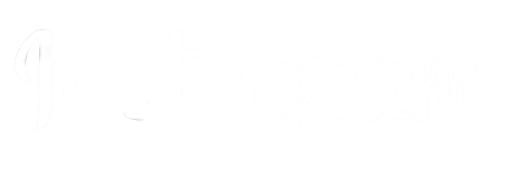

<h4>Language options</h4>
  
  

  <h3>Technologies used</h3>
  
  
  

## Description

A fully functional Instagram replica developed in React Native as part of my developer portfolio.

## Features

- User authentication.
- Discover, search, and share content and users.
- Create, edit, and share posts, stories, and reels.
- Easy image uploads from your device or camera.
- Social interaction: like, comment, and follow other users.
- Personalized user profiles with information and a list of posts.
- Real-time notifications and chat to keep you connected.

## Technologies Used

- Expo.
- React Native.
- Firebase (authentication and cloud storage).

## Download the application for Android devices

- 
- Available soon...

## Video of the application in operation on Android:

- Coming soon...

## Video of the application in operation on iOS:

- Coming soon...

## Screenshots

  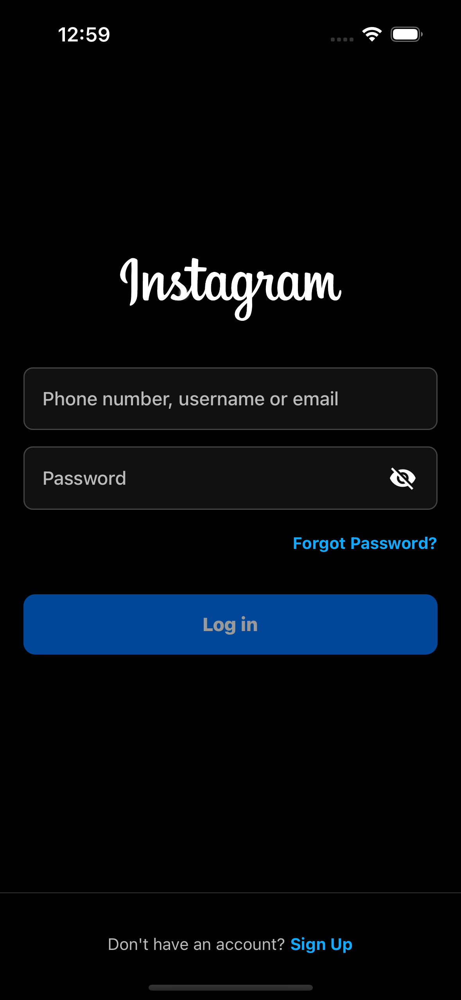
  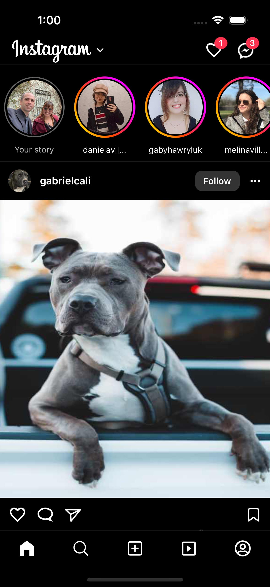
  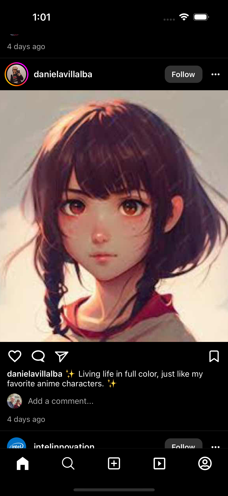
  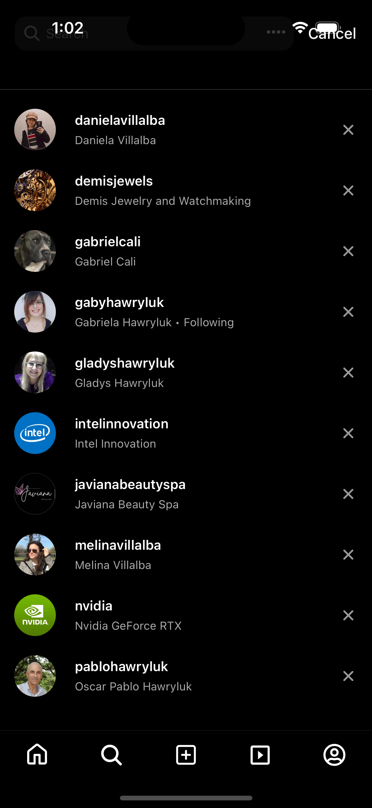
  
  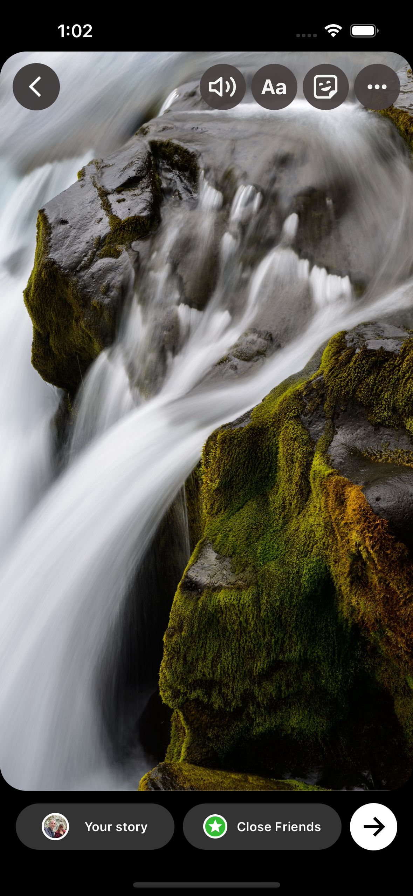
  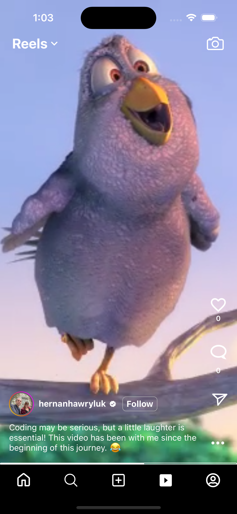
  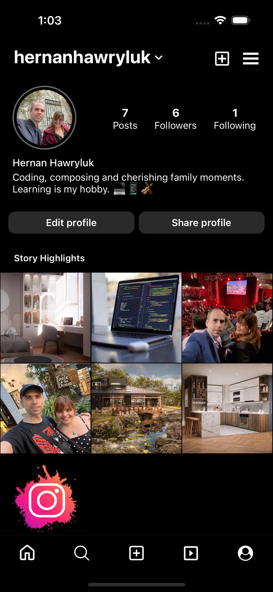
  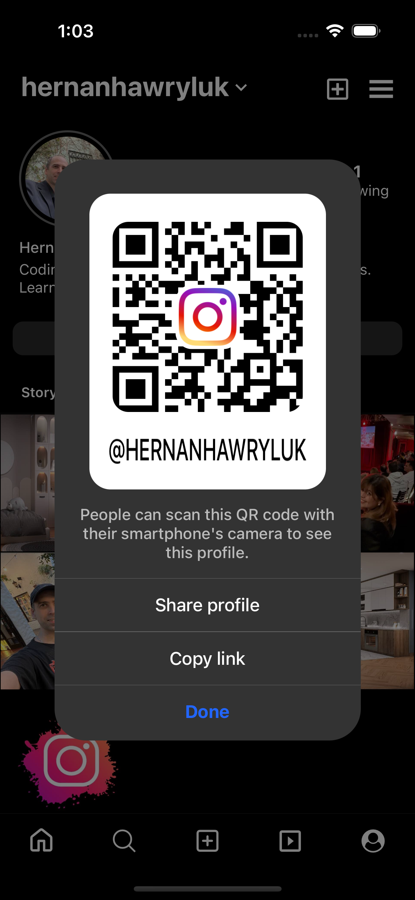
  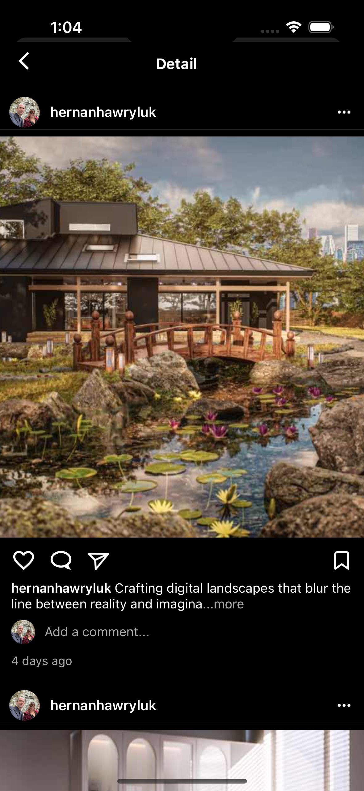
  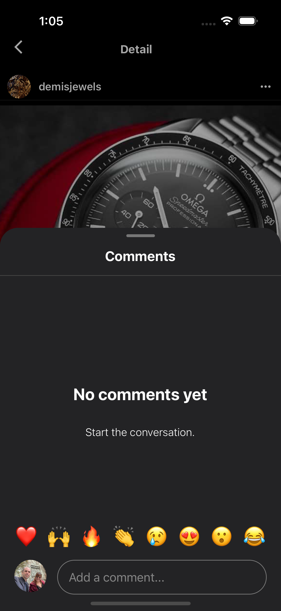
  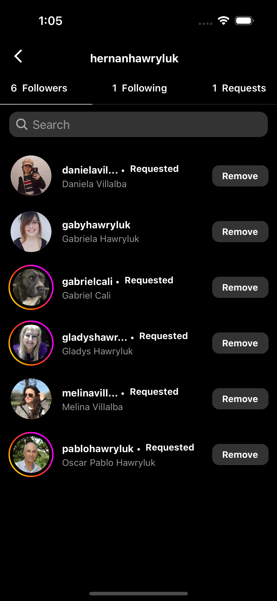
  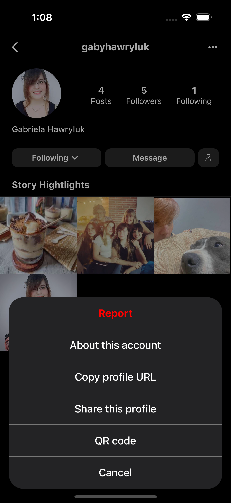
  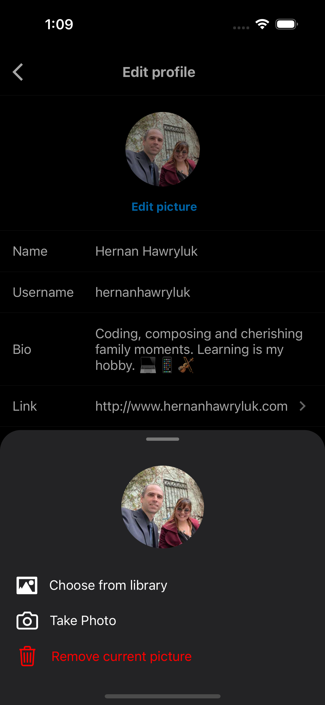

## Where to find me?

  
  

